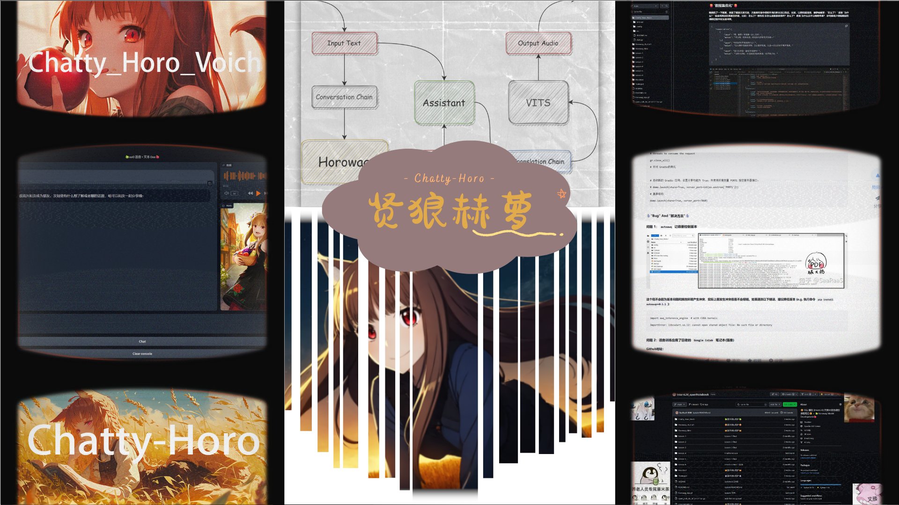
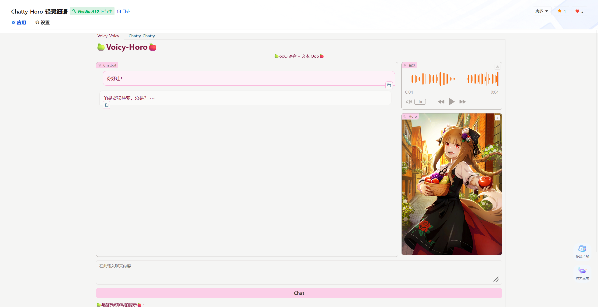

# 🍿**InternLM2_Horowag**🍿

🍏**专门为 2024 书生·浦语挑战赛 (春季赛) 准备的 Repo - 收录了赫萝相关的微调模型**🍎

## 🌠**基本介绍**

**`Horowag_7b` 是由书生·浦语的 `InternLM2-Chat-7b` 经过微调得到的角色扮演聊天系列机器人。具体目标是将《狼与香辛料》中贤狼赫萝的形象带入大语言模型，实现带入感较高的角色扮演行为。针对技术细节，`Horowag_7b` 使用了书生·浦语开源的 `Xtuner` 进行低成本微调训练，在训练条件较差的条件下，赋予模型高质量的自然语言处理能力。硬件方面，我采用了 `(1/2) A100` 支持训练，显存约 `40G` 左右，如果参数调节合理，显存可控制在 `16G` 以下。**

---

| 版本号 | 模型相关解释 |
|:-------:|:-------:|
| **Horowag_7b** | **InternLM2-Chat-7b 微调后的基础赫萝对话模型** |
| **Horowag_7b_Craft** | **优化数据增强方法 + Langchain 辅助模型输出** |
| **Horowag_Mini** | **InternLM2-Chat-1_8b 微调后的轻量级赫萝对话模型** |
| **Chatty_Horo_Voich** | **InternLM2-Chat-7b 微调 + Assistant Model + VITS** |
| **-- 亟待后续 --** | **--** |

---

## 🌠**衍生应用**

**除去基本的 `Horowag_7b` 链条，为了能够丰富语言模型角色扮演的模式和手段，我还推出了 `Horowag_7b_Craft`、`Horowag_Mini` 和 `Chatty_Horo_Voich` 等多个模型。其中，`Horowag_Mini` 基于 `InternLM2-Chat-1.8B` 模型，在低成本、低语料、低部署条件的约束之下，从角色提取、数据制备、模型微调再到应用部署，为动漫角色扮演 `LLM` 提供了可行的解决方案。最终 `Horowag_Mini` 演变为小参数应用 `Mini-Horo-巧耳`（下文称 `Mini-赫萝`)。`Mini-赫萝`尝试结合了小说文本、动漫对话等多种语料，为语言模型微调提供了独具特色的模式。确认提取的角色之后，该模型在微调任务中会创造对应的角色语言辅助规则，对数据进行针对性过滤。`Mini-赫萝` 在部署阶段更是融合 `Langchain` 技术，进一步提升了模型的角色代入能力。**

**另一个非常成熟的应用是 `Chatty_Horo_Voich`。该架构图展示了 `Chatty_Horo_Voich` 的核心构思。其中，我们输入的内容，也就是 `input text` 会进入 `assistant` 模块以及 `conversation chain`。这个对话链就是我们上一个视频提及的具有 `memory` 特性的架构，利用 `horowag` 模型生成赫萝的回答之后，`output text` 会在输出上稍加等待，先让 `assistant` 将输出内容置入 `translation chain` 完成中文向日语的转化，再将此日语语料加入微调后的`VITS` 模型，输出音频。当音频输出被检测到之后，`horowag` 才会输出 `output` 文本。保证用户在读取模型回答的时候，同步接受音频内容。**

## 🌠**程序介绍**

### **How to Install ? 👇**

    pip install -r requirements.txt

**选择你想要使用的模型，点开文件之后 ->**

    python start.py

**对于细节分析，需要有以下子应用报告及开发仓库：**

**1. [Horowag-开发仓库](https://github.com/SaaRaaS-1300/InternLM_openNotebook/)**

**2. 子报告 -> [Chatty-Horo-轻灵细语](https://github.com/SaaRaaS-1300/InternLM2_horowag/tree/main/Chatty_Horo_Voich)**

**3. 子报告 -> [Mini-Horo-巧耳](https://github.com/SaaRaaS-1300/InternLM2_horowag/tree/main/Horowag_Mini)**

**4. 子报告 -> [Horowag-微调开发](https://github.com/SaaRaaS-1300/InternLM2_horowag/tree/main/Horowag_7b_Craft)**

### **Resource About Models 👇** 

**1. InternLM2-Chat-7b + 微调 = [Horowag_7b_Chat_Ani](https://openxlab.org.cn/models/detail/SaaRaaS/Horowag_7b)**

**2. InternLM2-Chat-1_8b + 微调 = [Horowag_1_8b_Chat_Mini](https://openxlab.org.cn/models/detail/SaaRaaS/Horowag_Mini)**

## 🌠**OpenXLab**

**下载模型的代码示例：**

    from openxlab.model import download
    # 加载基础的语言模型 Horowag_7b
    download(model_repo='SaaRaaS/Horowag_7b',
             output='Horowag_7b')

**目前模型应用的部署情况：**

+ **应用程序链接** <<< 🍏[Chatty-Horo](https://openxlab.org.cn/apps/detail/SaaRaaS/Chatty-Horo)🍎 >>>
+ **OpenXLab模型链接：**[OpenXLab-Horo](https://openxlab.org.cn/models/detail/SaaRaaS/Horowag_7b)

## 🤖贡献墙🤖

+ **🆕那路 -> Horowag_7b🆕**

+ **🆕那路 -> Horowag_Mini🆕**

+ **🆕那路 -> Horowag_7b_Chat_Ani🆕**

+ **🆕那路 -> WebUI🆕**

+ **✨[Claire 同学](https://space.bilibili.com/14888344?spm_id_from=333.1007.0.0) -> 提供美术支持✨**

+ **✨[Claire 同学](https://space.bilibili.com/14888344?spm_id_from=333.1007.0.0) + 那路 -> 制备微调数据集✨**

## 👻致谢👻

+ **☃️感谢 [书生·浦语开源训练营](https://github.com/InternLM) 的技术指导以及算力☃️**
